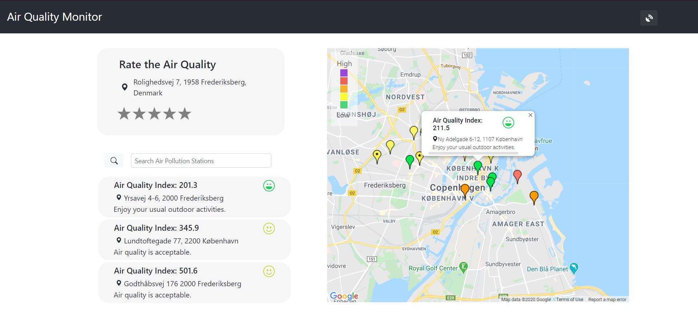
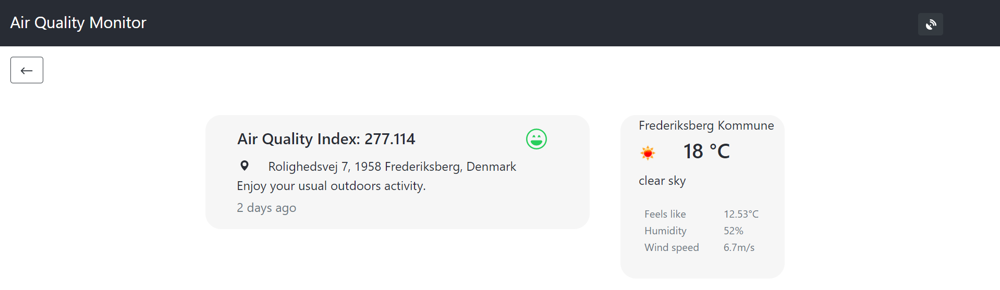
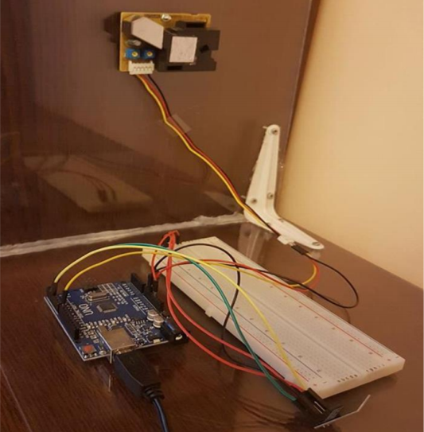

# Air Quality Monitor

An application for monitoring pollution in a city.  
The idea started with my bachelor thesis, where initially I implemented only a [mobile application using Java](https://github.com/dianasoponar/PollutionMap) and recently switching to a react app.

The project also includes a prototype for a pollution sensor.

In the project directory, you can run: `npm start`.  
Runs the app in the development mode. Open [http://localhost:3000](http://localhost:3000) to view it in the browser.

## Functionalities

* a user can see on a map the air pollution stations
* a user can interact with the map and click on the pollution stations for more details (e.g. address, pollution level)
* when the application starts it show the closest three air pollution stations to the user's location
* the closest three air pollution stations can be filtered to a new address

### Rating functionality
A user can rate the air quality in its current location. The rating will appear on the map (still needs improvements).

In order to store the data the app is using [Firebase](https://firebase.google.com/).

### Prototype page

## Air Pollution Prototype
The air pollution sensor identifies the PM 2.5 (small particulate matter) and sends the results every couple of seconds to [ThingSpeak](https://thingspeak.com/).  
In order to build the pollution sensor I used the following components:
* Arduino Uno
* Wi-Fi Module ESP8266
* Grove – Dust Sensor (PPD42NS)
* Wire connectors

